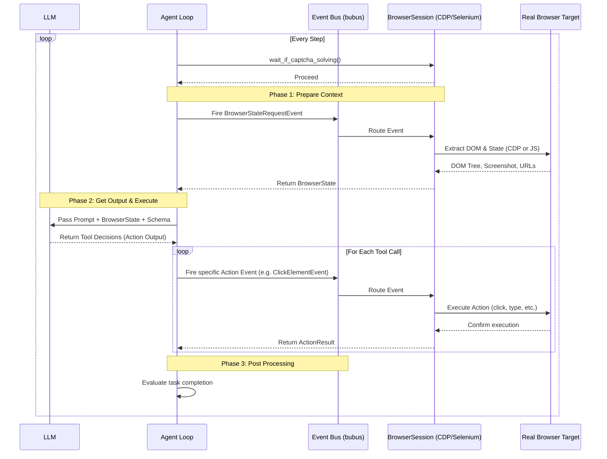

# CDP & Selenium Agent Workflow

The `browser-use` library uses a shared, agnostic agent loop and routes browser interactions through a common event bus to either a CDP or Selenium backend.

## High-Level Architecture

```mermaid
flowchart TD
    Agent[Agent\n(agent/service.py)] -->|Action calls / State Requests| EventBus
    
    subgraph Event Bus [bubus Event Bus]
        Events[NavigateToUrlEvent\nClickElementEvent\nBrowserStateRequestEvent\netc...]
    end
    
    EventBus --> Interface[BrowserSession Base\n(browser/session.py)]
    
    Interface --> CDP[CDP Backend\n(Chrome DevTools Protocol)]
    Interface --> Selenium[Selenium Backend\n(Cross-Browser Support)]
    
    subgraph Browser Execution
        CDP -->|WebSocket/Runtime.evaluate| Chrome[Chromium Browser]
        Selenium -->|WebDriver API + Injected JS| Firefox[Firefox / Safari / Chrome]
    end
    
    Chrome -.->|DOM Snapshot / State| CDP
    Firefox -.->|JS Exection / State| Selenium
    
    CDP -.-> Interface
    Selenium -.-> Interface
    Interface -.->|Returns State & ActionResult| Agent
```

## Agent Action Loop (`step()`)

The main execution cycle for the AI agent occurs in the `step()` function. It remains completely unaware of which backend is powering the browser interactions.



## Backend Disambiguation

Both backends handle events dispatched by the `Agent` through `bubus`, but their internally mechanisms for extracting the DOM and executing actions differ:

| Feature | CDP Backend (`browser_use/browser/session.py`) | Selenium Backend (`browser_use/browser/selenium_session.py`) |
| --- | --- | --- |
| **DOM Extraction** | Native `CDP DOMSnapshot` via `browser_use/dom/service.py`. Fast and native. | JavaScript injection via `browser_use/selenium/dom_service.py` (`dom_tree_js/index.js`). |
| **Action Execution** | Direct CDP commands (`Input.dispatchMouseEvent`, etc.) | Selenium WebDriver bindings (`ActionChains`, `element.click()`, etc.) |
| **Event Routing** | Subscribes & dispatches raw CDP events (e.g. `downloadWillBegin`) | Adapts to listen to WebDriver state changes. |
| **Connection** | Direct WebSocket | Selenium Server / Local WebDriver Socket |
